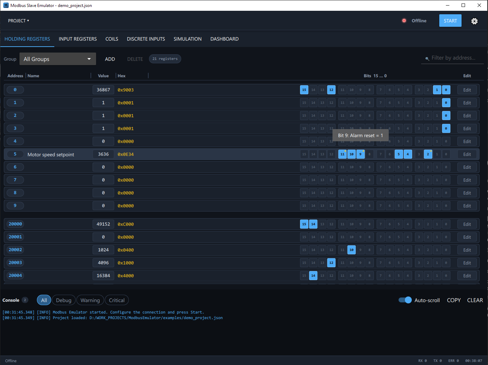
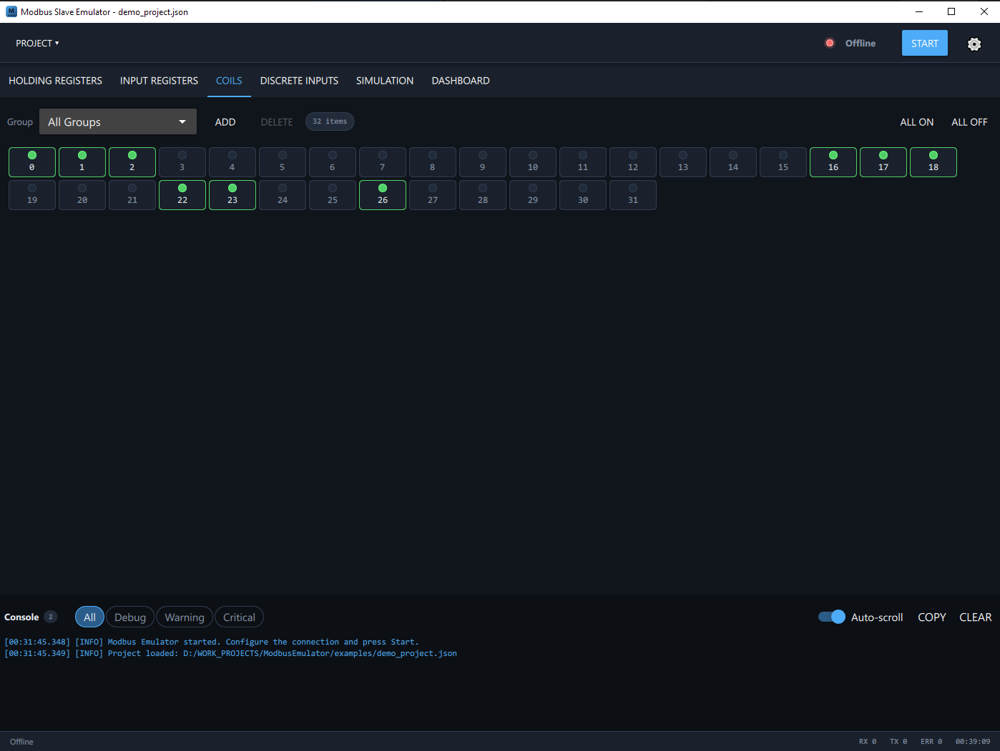
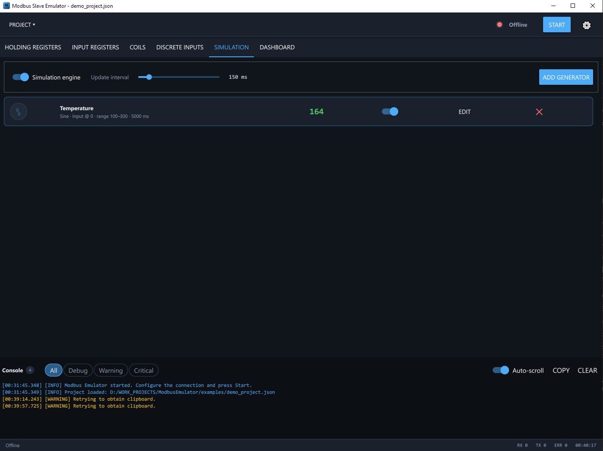
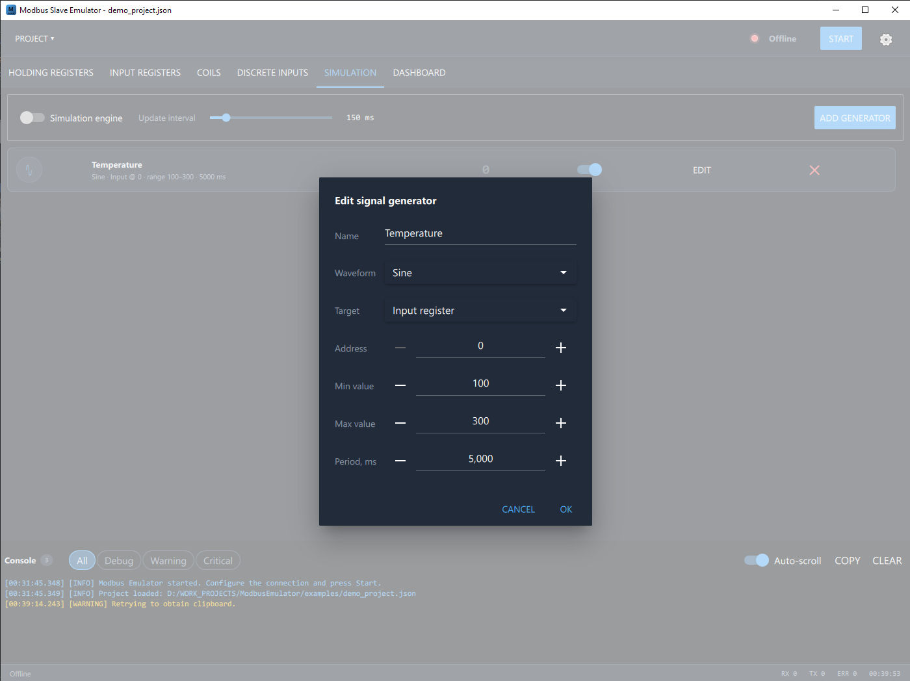
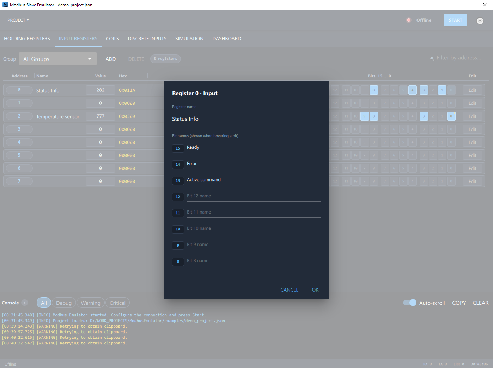
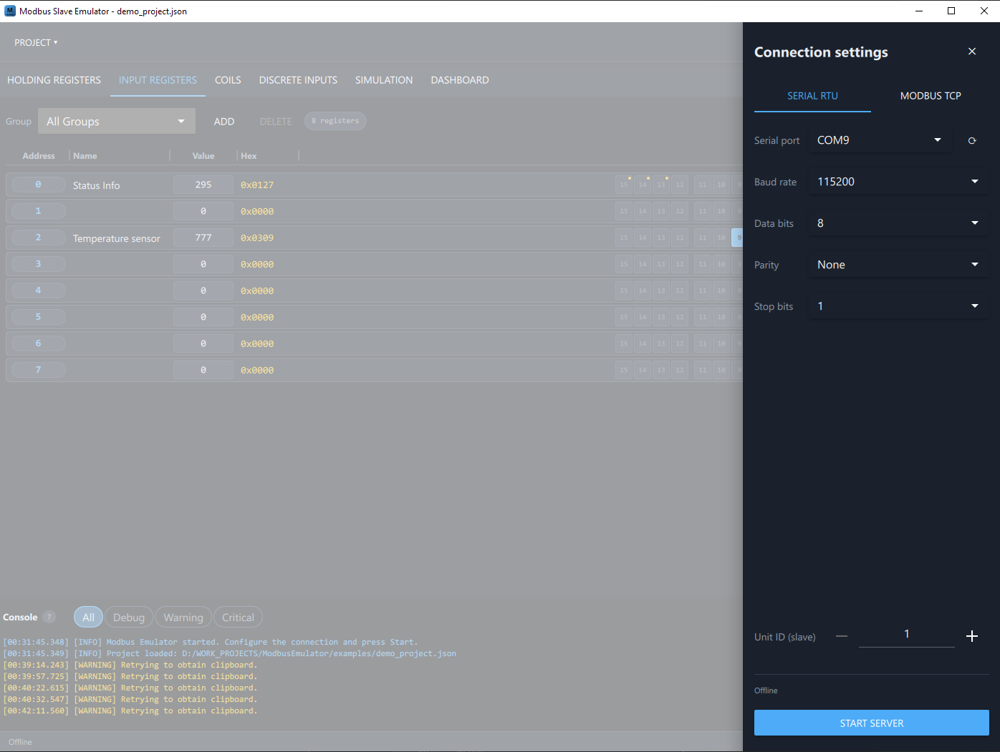

# Modbus Slave Emulator


A desktop Modbus slave (server) emulator built with **Qt 6 / QML (Qt Quick)** and C++.
It emulates a field device on either a serial line (**Modbus RTU**) or a network
socket (**Modbus TCP**), exposes all four Modbus tables for live editing, and can
feed registers with generated waveforms so a connected master sees realistic
process data.

The project is a QML showcase: a custom dark industrial theme, a component-based
UI, Canvas-drawn real-time charts, animated delegates, and a clean C++ backend
integration via context properties, `Q_PROPERTY` and `Q_INVOKABLE`.

| Registers | Coils | Simulation |
|---|---|---|
|  |  |  |

| Signal generator | Register bit names | Connection settings |
|---|---|---|
|  |  |  |

## Features

- **JSON project files**: the whole emulator state - connection settings,
  all four Modbus tables, register groups, signal generators and view
  settings - is saved to a human-readable `.json` project
  (Project menu / Ctrl+S, Ctrl+O, Ctrl+N; the last project reopens on start).
  See [examples/demo_project.json](examples/demo_project.json).
- **Modbus RTU and Modbus TCP** server modes, switchable at runtime
- Full connection editor: serial port (with rescan), baud rate, data bits,
  parity, stop bits, TCP port, unit ID
- **Holding / Input registers** editor
  - named address groups stored in the project file, plus an
    "All Groups" combined view
  - live filtering by address, column header
  - single-line rows: decimal / hex value plus an inline **16-bit editor**
- **Coils / Discrete inputs** as an LED-style toggle grid (`GridView`),
  organized in the same named address groups with an "All Groups" view
- **Signal simulation engine**: sine, square, ramp, random and increment
  generators writing into any register at a configurable interval
- **Dashboard**: read/write/error counters, uptime, and a real-time
  auto-scaling trend chart of any register drawn on a `Canvas`
- **Console** with severity filtering, batched updates, copy-to-clipboard
  and smart auto-scroll
- Two-way synchronization: values written by the Modbus master appear in the
  UI instantly; UI edits are pushed to the server data map

## Architecture

```
Sources/
  main.cpp            application setup, context properties, Material style
  ModbusServer.*      QML facade over QtSerialBus (RTU/TCP), statistics,
                      bidirectional sync with the data store
  ModbusDataStore.*   singleton storage for all four Modbus tables
  ProjectManager.*    JSON project save/load, last-project persistence
  LogHandler.*        Qt message handler -> QML log model (batched)
qml/
  Main.qml            application shell: header, tabs, split view, footer
  Theme.qml           singleton with design tokens and formatting helpers
  ConnectionDrawer.qml  RTU/TCP settings drawer (persisted)
  RegisterView.qml    register table with groups, filter, persistence
  RegisterDelegate.qml  expandable register row with bit editor
  CoilsView.qml       LED toggle grid for coils / discrete inputs
  SimulationPanel.qml waveform generator engine (Timer driven)
  DashboardView.qml   statistics tiles + live register trend
  ValueChart.qml      Canvas line chart (auto-scale, grid, gradient fill)
  LogPanel.qml        filterable console
  StatusIndicator.qml pulsing connection LED
  StatTile.qml        dashboard metric card
  GroupDialog.qml     register group creation dialog
```

Key implementation notes:

- `ObservableModbusServer<Base>` is a small template mixin that hooks
  `QModbusServer::readData()` to observe client read traffic for both the RTU
  and the TCP base classes without duplicating code.
- `QModbusServer::setData()` internally re-emits `dataWritten()` and triggers
  `readData()`; an internal-update guard keeps the emulator's own writes out
  of the traffic statistics and prevents echo loops.
- QML delegates re-evaluate their value bindings through a lightweight
  `dataRevision` counter bumped on every `dataChanged()` signal, avoiding
  per-delegate `Connections` objects.

## QML techniques demonstrated

`ApplicationWindow` (Material dark), `ToolBar`, `TabBar`/`TabButton`,
`Menu`/`Action`/`MenuSeparator`, `Shortcut`, `FileDialog`, `StackLayout`,
`SplitView` with a custom handle, `Drawer`, `Dialog`, `ListView`/`GridView`
with add/remove `Transition`s, `Repeater`, `Canvas`, `Timer`, singleton
`QtObject` theme, `Behavior` animations, `SequentialAnimation`,
`TapHandler`/`HoverHandler`, `ToolTip`, `SpinBox`, `ComboBox` with
`valueRole`, `Switch`, `Slider`, `RoundButton`, custom-styled
`AbstractButton`, layout system (`RowLayout`/`ColumnLayout`/`GridLayout`).

## Building

Requirements: Qt 6.4+ (Core, Gui, Qml, Quick, QuickControls2, SerialPort,
SerialBus, Sql), CMake 3.16+, a C++17 compiler.

```bash
cmake -S . -B build -DCMAKE_PREFIX_PATH=<path-to-Qt>
cmake --build build
```

## Testing without hardware

- **TCP**: start the server in Modbus TCP mode and connect any Modbus master
  (e.g. QModMaster, modpoll) to `127.0.0.1:502`.
- **RTU**: create a virtual serial port pair (e.g. com0com), start the
  emulator on one end and a Modbus master on the other.

## License

The source code of this project is released under the **MIT License** - see [LICENSE](LICENSE).

### Third-party: Qt (LGPLv3)

This application is built with the **Qt 6** framework (Qt Quick, Qt SerialBus and related modules), used under the **GNU Lesser General Public License v3 (LGPLv3)**. Keeping the application's own code under the permissive MIT license is compatible with the LGPLv3, on the following conditions, which this project meets:

- **Dynamic linking** - the Qt libraries are linked dynamically, never statically, so a user can replace or relink the Qt libraries.
- **Source availability** - the corresponding source of the Qt libraries is available from <https://www.qt.io/> and <https://code.qt.io/>.
- **Notices** - the LGPLv3 terms and the Qt copyright are acknowledged here; the full LGPLv3 text is at <https://www.gnu.org/licenses/lgpl-3.0.html>.
